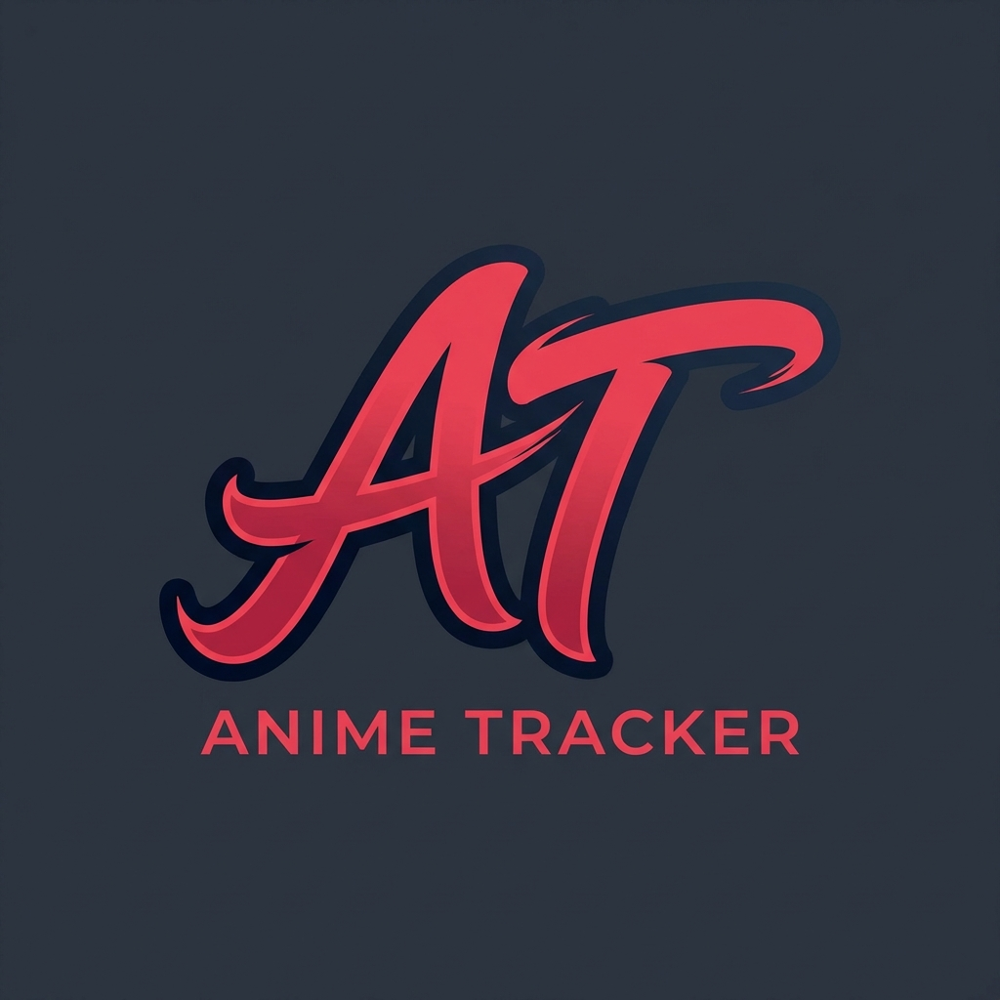

# 🏯 AnimeTracker

## 💡 Perché AnimeTracker?

Ti è mai capitato di seguire 5, 10 o addirittura 15 anime contemporaneamente ogni stagione? Tra simulcast settimanali e serie recuperate, è facilissimo perdere il conto: *"Ma ero all'episodio 7 o all'8?"*.

L'idea di **AnimeTracker** è nata proprio da questa necessità personale. Volevo uno strumento che fosse **immediato, senza fronzoli e bellissimo da vedere**, che mi permettesse di segnare il progresso in un secondo e di averlo sempre sincronizzato tra PC e Smartphone.

## 🌐 Accesso Rapido & Cloud

Non è necessario scaricare nulla! AnimeTracker è una **PWA (Progressive Web App)** con sincronizzazione Cloud.

🚀 **[Vai all'App Online](https://girardinicolas.github.io/AnimeTracker/)**

1. **Crea un Account**: Registrati con la tua email per avere la tua lista privata.
2. **Sincronizzazione**: Accedi da qualsiasi dispositivo (PC, Tablet, Smartphone) e troverai i tuoi dati sempre aggiornati.
3. **Installa su Mobile**: 
   - **Android**: Clicca sui tre puntini e seleziona "Installa App".
   - **iOS**: Clicca sul tasto "Condividi" e seleziona "Aggiungi alla Home".

## ✨ Caratteristiche Principali

- **☁️ Cloud Sync**: I tuoi dati sono al sicuro nel cloud di Supabase, accessibili ovunque.
- **🔐 Auth Sicura**: Sistema di Login/Registrazione per proteggere la tua collezione personale.
- **🚀 Performance Estreme**: Sviluppata con Vite e React per un caricamento istantaneo.
- **🪄 Magic Autocomplete**: Suggerimenti in tempo reale mentre scrivi il titolo, con recupero automatico di poster e info.
- **⭐ Official Ratings**: Voti ufficiali presi direttamente da MyAnimeList.
- **🎡 Lucky Spin**: Lascia che il destino scelga per te tra i tuoi anime "Da Vedere".
- **🌍 Multi-lingua**: Supporto completo per Italiano e Inglese.
- **📅 Season Tracking**: Tieni traccia della stagione specifica che stai guardando.
- **🤖 Smart Flow**: Gli anime si spostano automaticamente tra le categorie in base al tuo progresso.

## 🛠️ Tech Stack

- **Frontend**: [React](https://react.dev/) + [TypeScript](https://www.typescriptlang.org/)
- **Build Tool**: [Vite](https://vitejs.dev/)
- **Styling**: [Tailwind CSS v4](https://tailwindcss.com/)
- **Animations**: [Framer Motion](https://www.framer.com/motion/)
- **Backend & Auth**: [Supabase](https://supabase.com/)
- **API**: [Jikan API](https://jikan.moe/) (MyAnimeList)

## ✍️ Autore

Sviluppato con passione da **NicolasGirardiJD**.

---
*Creato per i veri fan degli anime che desiderano un tracker elegante, potente e sempre sincronizzato.*
